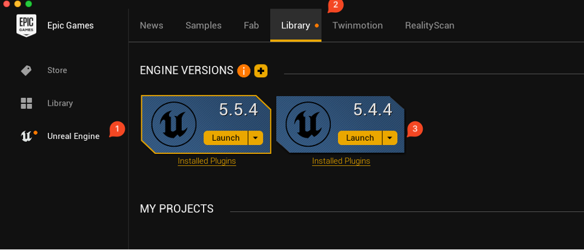

# Shoot-a-Car: A Turret-Shooting Taster in Unreal Engine 5

Welcome! This taster session is designed to give you a hands-on introduction to game development with Unreal Engine 5. You will learn the basics of the engine, how to work with existing assets, and how to implement simple game mechanics.

## Session Goals

By the end of this activity, you will have:
- A foundational understanding of the Unreal Engine 5 interface.
- Experience in loading and working with a game template.
- An appreciation for rapid prototyping using pre-existing assets.
- Familiarity with the Unreal Engine Marketplace (now Fab) and project templates.

## 1. Getting Started with Unreal Engine

Unreal Engine is the powerhouse behind many of today's most popular games, from *Fortnite* and *PUBG* to critically acclaimed titles like *The Last of Us Part I* and *Final Fantasy VII Remake*.

**Installation:**
- **At home:** Download and install the Epic Games Launcher from [epicgames.com](https://www.epicgames.com). In the launcher, navigate to the "Unreal Engine" tab and install version 5.4 or later.
- **On campus:** Unreal Engine is already installed and ready to go.

**Engine Interface:**
The Unreal Engine interface can seem complex at first. For a helpful overview, you can watch this introductory video. Although it was made for Unreal Engine 4, most of the concepts are still applicable in UE5.
- [Introduction to the Unreal Engine Interface](https://youtu.be/CmbGUIdz7GU)

## 2. Project Overview: Adding a Turret to a Car

In this project, we're going to modify a pre-built vehicle template by adding a fully functional turret. The goal is to create a simple, fun mechanic where you can shoot at other cars.

We will be working with the `ShootACar_blank` project.

### Our Plan:
1.  **Find a Turret:** We'll use a pre-made asset from the marketplace.
2.  **Animate the Turret:** We'll use the turret's skeletal bones to allow it to move.
3.  **Create a Projectile:** We'll borrow a projectile from the First-Person template.
4.  **Implement Firing:** We'll set up input controls to fire the projectile from a socket on the turret.
5.  **Add Physics:** We'll make the projectile apply a force to any car it hits.
6.  **(Optional) Further Enhancements:**
    -   Add visual effects (VFX) for firing and impacts.
    -   Modify the projectile's properties.
    -   Implement a scoring system or user interface (UI).
    -   Add sound effects.

## 3. Implementation Steps

### The Turret Asset

The project already includes a "Sci-Fi Turret" asset, originally from the Unreal Engine Marketplace. You can find it in the `Content/SciFiturretasset` folder.

> #### Discussion Point: Using Pre-made Assets
> In professional game development, using pre-made assets is a common practice, especially for rapid prototyping. This involves considering:
> - **Legal & Ethical:** Licensing agreements and whether you can use free assets in a commercial product.
> - **Commercial:** The cost-benefit of buying assets versus creating them in-house.
> - **Technical:** Ensuring assets are well-optimised (e.g., polygon count) and technically sound.

### Adding the Turret to the Car

We'll add the turret as a component to the player's car. The car is a Blueprint asset located at `Content/VehicleTemplate/Blueprints/StarterWheeledVehiclePawnBP`.

1.  Open the `StarterWheeledVehiclePawnBP` Blueprint.
2.  Add a **Poseable Mesh** component to the Blueprint. *Challenge: Why use a Poseable Mesh instead of a Skeletal Mesh?*
3.  In the Details panel for the new component, set the **Skeletal Mesh** to `SKM_scifiturret`.
4.  Position and scale the turret on the car's roof. A good starting point is `Location: (-33, 0, 116)` and `Scale: (0.5, 0.5, 0.5)`.

### Animating the Turret

To make the turret move, we need to rotate its bones.

1.  Open the `SKM_scifiturret` Skeletal Mesh asset to inspect its skeleton. The bone we want to rotate is named `bn_head`.
2.  While the Skeletal Mesh is open, create a **Socket** to define where projectiles will spawn from. Right-click on the `bn_headbarrelend` bone and select "Add Socket". You can leave the default name. Move the socket so it's positioned just in front of the barrel. *Challenge: Why is it important to place the socket slightly away from the mesh?*

Now, let's add the rotation logic to the `StarterWheeledVehiclePawnBP` Event Graph.

> In the Blueprint, you'll notice that the output of `GetWorldRotation` is split into its individual components (pitch, yaw, roll), and only the yaw value is connected to the "Set Bone Rotation by Name" node. This is because we typically want the turret to rotate only around the vertical axis (yaw), so it can turn left and right, but not tilt up/down (pitch) or roll sideways.
>
> *Challenge: Why do you think it's important to isolate and use only the yaw value when rotating the turret's bone? What might happen if you used all three rotation components instead?*

> **Note on Best Practices:** For this taster, we're using the `Event Tick` to quickly prototype the turret's rotation. In a real-world project, this would be inefficient. A better approach would be to use a more optimised animation system and event-driven controls.

### Firing Projectiles

We'll use a pre-made projectile from the First-Person template, which is already included in the `SciFiturretasset` folder.

First, we need to set up an input for firing. This project uses the older input system.
1.  Go to **Project Settings > Engine > Input**.
2.  Add a new **Action Mapping** named `FireWeapon` and assign it to the **Left Mouse Button**.

Now, let's add the firing logic to the `StarterWheeledVehiclePawnBP` Event Graph.

> **Note:** When spawning the projectile, make sure to use the transform (location and rotation) of the socket you created on the turret's barrel. This ensures that the projectile appears at the correct position and points in the right direction, matching the end of the barrel exactly.

Finally, for a bit of fun, you can increase the impact force of the projectile.
1.  Open the `BP_FirstPersonProjectile` Blueprint.
2.  Find the `Impulse` variable or the relevant node in the graph and increase its value. Experiment to see what works best!

> **Note:** In the original template, the code checked if the hit object was simulating physics before applying an impulse. In this project, we've replaced that with a cast to the vehicle pawn to ensure only vehicles are affected. While casting works for quick prototyping, it's generally not best practice in production code, as it tightly couples your logic to a specific class. A more robust approach would be to use interfaces or check for a shared parent class, making your code more flexible and maintainable.

## That's a Wrap!

You've now successfully added a functional turret to a car in Unreal Engine. Feel free to continue experimenting with the project and exploring what else you can create.

---

## Next Steps: Enhancements

Here are a few ideas for how you might extend your project further, with some tips to help you get started even if you're new to Unreal Engine:

- **Add visual effects (VFX) for firing and impacts:**
  1. In the Content Browser, right-click and choose 'FX' > 'Niagara Emitter' or 'Particle System' to create a new effect, or use an existing one from the Starter Content (e.g., 'P_Explosion').
  2. Open your projectile's Blueprint (e.g., `BP_FirstPersonProjectile`).
  3. To add a muzzle flash, use the 'Spawn Emitter at Location' node in the Event Graph, connecting it to the projectile's spawn event and setting the location to the socket or barrel tip.
  4. For impact effects, use the 'On Hit' event in the projectile Blueprint to spawn an emitter at the impact location.

- **Modify the projectile's properties:**
  1. Open the projectile Blueprint.
  2. Select the 'Projectile Movement' component in the Components panel.
  3. In the Details panel, try changing values like 'Initial Speed', 'Max Speed', 'Gravity Scale', or 'Bounciness'.
  4. To change the projectile's appearance, select the mesh or material and swap it for another asset in your project.

- **Implement a scoring system or user interface (UI):**
  1. In the Content Browser, right-click and choose 'User Interface' > 'Widget Blueprint' to create a new UI widget (e.g., `ScoreWidget`).
  2. Open the widget and drag a 'Text' element onto the canvas to display the score.
  3. In your vehicle or player Blueprint, create a variable to track the score.
  4. When a target is hit, increase the score variable and update the widget using the 'Set Text' node.
  5. Add the widget to the viewport using the 'Create Widget' and 'Add to Viewport' nodes in your Blueprint's Begin Play event.

- **Add sound effects:**
  1. Import a sound file (WAV format) by dragging it into the Content Browser, or use a sound from the Starter Content (e.g., 'Explosion_Cue').
  2. In your projectile or turret Blueprint, use the 'Play Sound at Location' node to play a sound when firing or on impact.
  3. Connect the node to the appropriate event (e.g., when the projectile is spawned or hits something), and set the location to the barrel tip or impact point.

These steps should help you get started with each enhancement. Don't be afraid to experiment—Unreal Engine is a great place to learn by doing!

